# C# Study Guide: Reading and Writing C#

A comprehensive guide to mastering C# fundamentals, syntax, and best practices.

---

## 📚 Table of Contents

1. [Getting Started](#getting-started)
2. [Core Concepts](#core-concepts)
3. [Syntax & Basics](#syntax--basics)
4. [Object-Oriented Programming](#object-oriented-programming)
5. [Advanced Topics](#advanced-topics)
6. [Best Practices](#best-practices)

---

## 🚀 Getting Started

### Learning Path

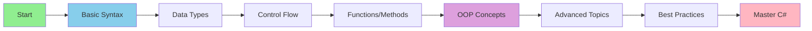

### Time Commitment Breakdown

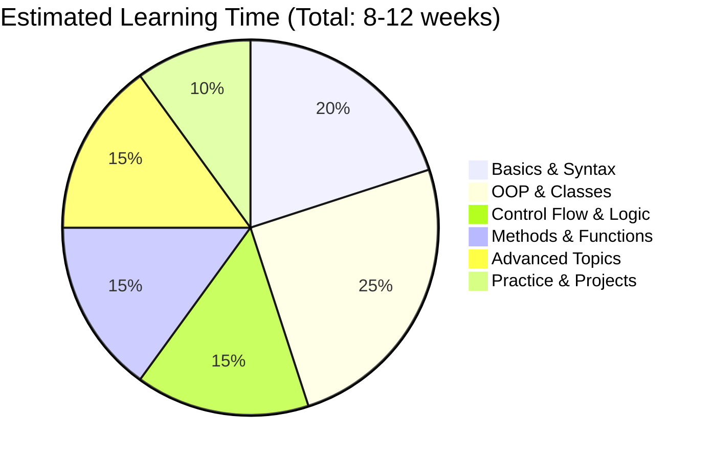

---

## 🎯 Core Concepts

### C# Language Features

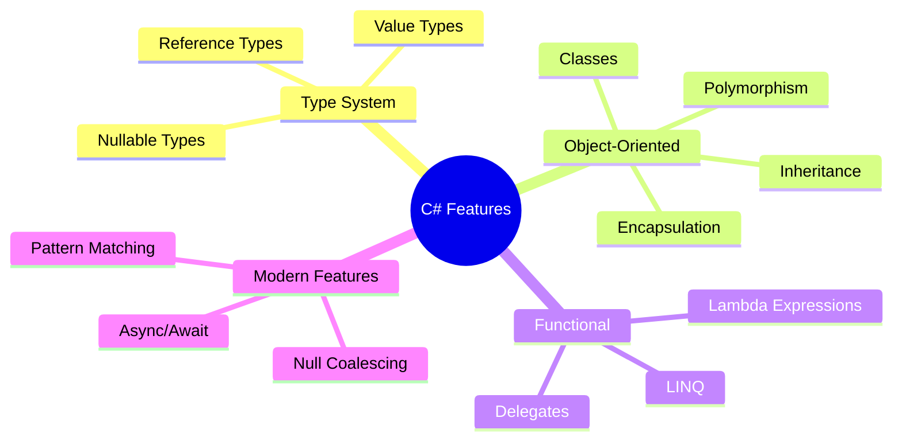

---

## 💻 Syntax & Basics

### Data Types Hierarchy

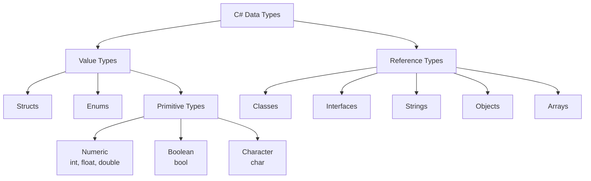

### Control Flow Diagram

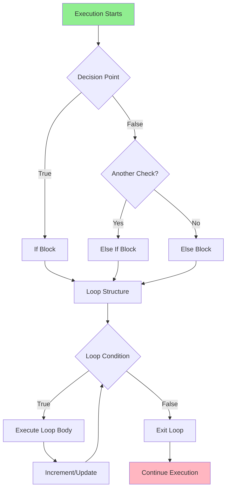

### Basic Syntax Example

```csharp
// Hello World Program
public class Program
{
    public static void Main()
    {
        string message = "Hello, C#!";
        Console.WriteLine(message);
    }
}
```

---

## 🏛️ Object-Oriented Programming

### OOP Pillars

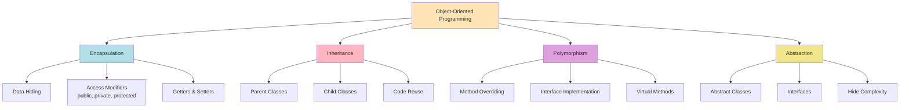

### Class Structure

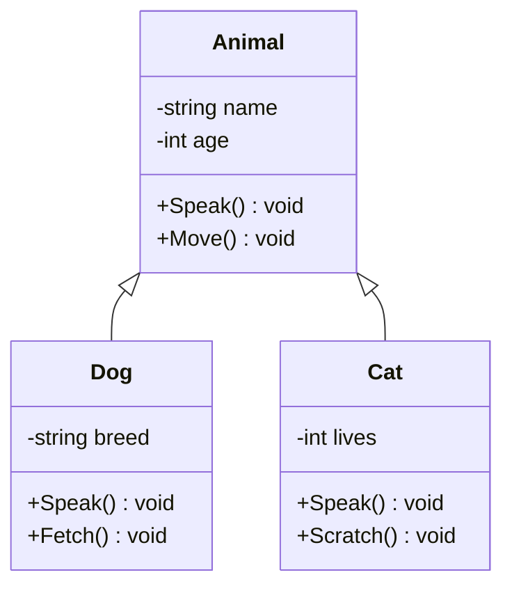

---

## 🚀 Advanced Topics

### Async/Await Flow

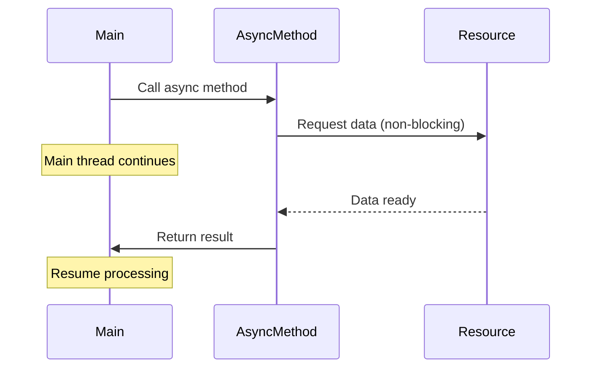

### LINQ Query Pipeline

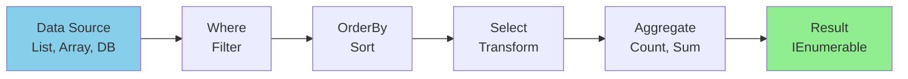

### Exception Handling Flow

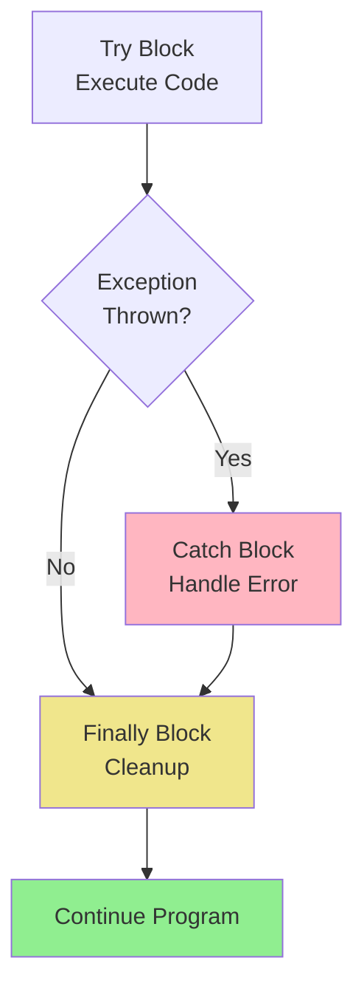

---

## ✅ Best Practices

### Code Quality Checklist

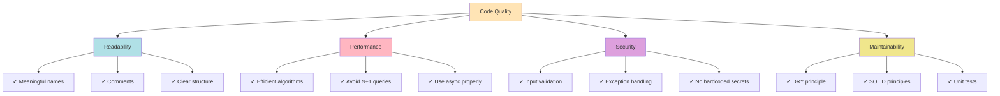

### SOLID Principles

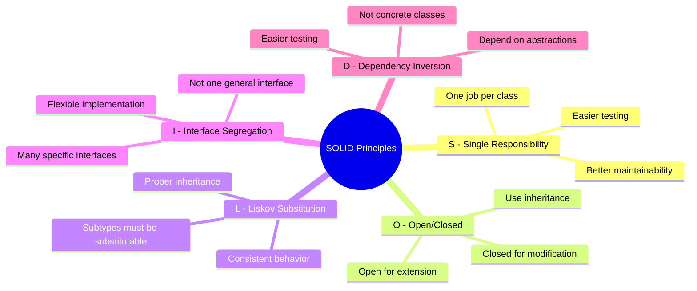

---

## 📊 Skills Progression Matrix

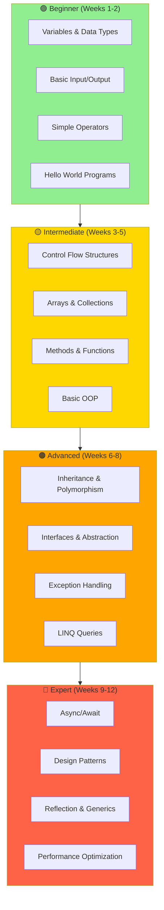

---

## 🎓 Sample Exercises by Difficulty

### Easy ✅
- Write a program that adds two numbers
- Create a simple calculator
- Check if a number is prime
- Reverse a string

### Medium 🟡
- Implement a person class with properties and methods
- Create a student management system
- Build a basic banking system
- Implement inheritance with animals

### Hard 🔴
- Create a LINQ query for complex data filtering
- Implement async file processing
- Design a multi-threaded producer-consumer
- Build a plugin architecture with reflection

---

## 📈 Progress Tracking

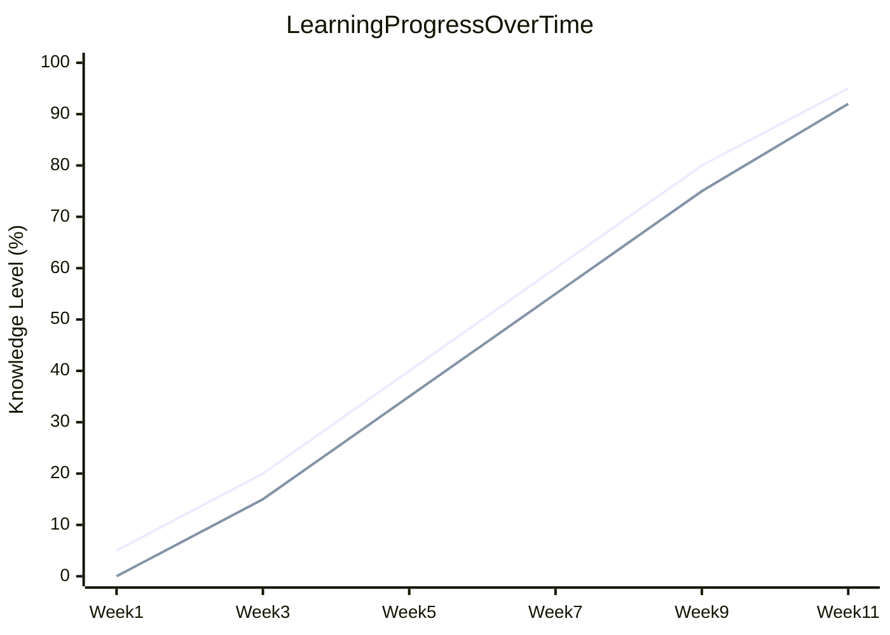

---

## 🔗 Quick Reference

| Concept | Example | Use Case |
|---------|---------|----------|
| **Variable Declaration** | `int age = 25;` | Store data |
| **If Statement** | `if (age > 18) { ... }` | Conditional logic |
| **For Loop** | `for (int i = 0; i < 10; i++)` | Iterate through collection |
| **Method** | `public void Greet(string name) { }` | Reusable code blocks |
| **Class** | `public class Person { }` | Object blueprint |
| **Interface** | `public interface IAnimal { }` | Contract for classes |

---

## 📚 Resources for Further Learning

- **Official Documentation**: Microsoft Docs - C# Language Reference
- **Interactive Coding**: LeetCode, HackerRank
- **Practice Projects**: GitHub repositories with C# examples
- **Community**: Stack Overflow, C# Discord Communities

---

**Last Updated**: October 2026  
**Difficulty Level**: Beginner to Advanced  
**Estimated Time**: 8-12 weeks
